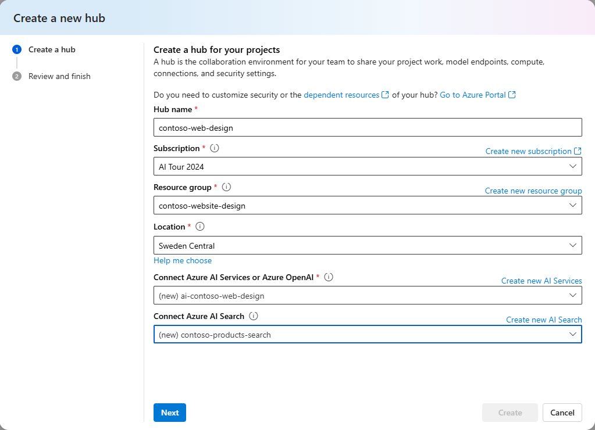

# Set up

## From the **Studio UI**

Follow the steps below to set up the Azure AI Studio environment for this demo.

1. Navigate to [Azure AI Studio](ai.azure.com) and login with your Azure account. A hub provides a collaborative workspace to host your projects.
1. In the *Management* section, go to *All hubs* and then *Create a new hub*
1. In the configuration page, fill in the required fields. The recommended location for running this demo is **Sweden Central**, for the sake of models availability. Create a new Azure AI services to enable access to Azure OpenAI Service and an AI Search service to enable the search functionality.

1. Once the hub is created, navigate to *All projects* and click on *+ New Project* to create a new project. Make sure you select the hub you just created. 
1. In your newly created project, navigate to the *Deployments* page, under the *Components* section. Click on *+ Create deployment* to create a new deployment. For this demo you'll need 3 gpt instances: *gpt4-o*, *gpt-4* and *text-embedding-ada-002*. This is how your project's deployments section should look like:

At the end of this step, if you navigate to the [Azure Portal](portal.azure.com) your project resource group should look like this:

where the key vault and the storage account are created by default when you create a new Azure AI Studio hub.

## From the **Azure CLI**

TBD 
